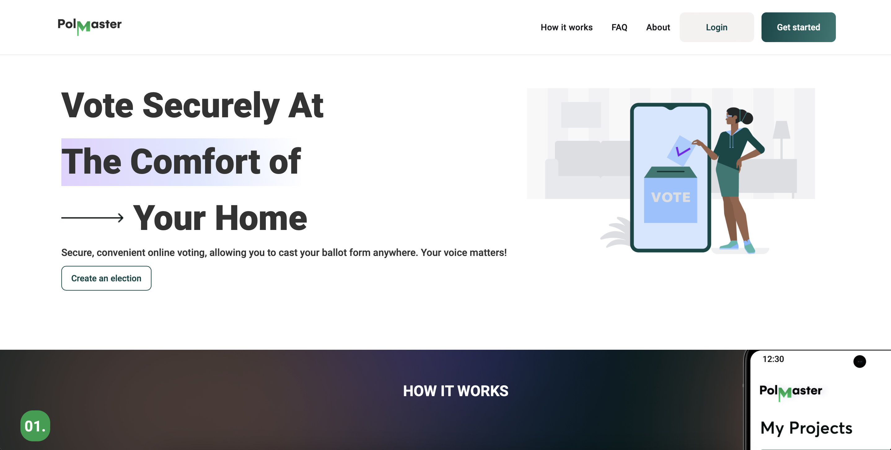

# Online Voting System (PollMaster)

This is an online voting system built with Python, using Flask and SQLAlchemy.

This application aims to simplify and enhance the voting experience, allowing
eligible voters to cast their ballots conveniently from any location with internet
access. We ensure our application has a very good user interface and experience,
as well as very reliable and sophisticated API. Pollmaster web interface and its
API with designed routes can be accessed at [https://pollmaster.me](https://pollmaster.me) and [https://api.pollmaster.me](https://api.pollmaster.me) respectively.



## Features

- Create and manage elections
- Add candidates to elections
- Voters can vote for candidates in an election
- View election results

## Installation and Usage

1. Clone the repository:
    ```
    git clone https://github.com/ShegzBit/Online-Voting-App.git
    cd Online-Voting-App
    ```

2. Install the requirements:
    ```
    pip3 install -r requirements.txt
    ```

3. Set up the database:
    ```
    cat setup_mysql_dev.sql | mysql -uroot -p
    ```

4. Run the application:
    ```
    python3 -m api.v1.app
    ```

5. Make request to the system api
    e.g
    ```bash
    curl -X POST -H 'Content-Type: application/json' -d '{
        "first_name": "Feranmi",
        "last_name": "Awotubo",
        "email": "ibukun12345678910@gmail.com",
        "password": "my_password"
    }' http://0.0.0.0:5000/api/v1/sign_up
    ```
    Sign up response
    ```json
    {
        "status": "successful"
        "user": {
            "__class__":"Admin",
            "created_at":"2024-02-08 10:00:32",
            "elections"{},
            "email":"ibukun12345678910@gmail.com",
            "first_name":"Feranmi",
            "id":"03939f31-1511-4c62-8af4-75cbd3389ad9",
            "last_name":"Awotubo",
            "username":"ibukun12345678910"
        }
    }
    ```

    ```bash
    curl -X POST -H 'Content-Type: application/json' -d '{
        "email": "ibukun12345678910@gmail.com",
        "password": "my_password"
    }' http://0.0.0.0:5000/api/v1/sign_in
    ```
    Response
    ```json
    {
        "status":"successful",
        "user":{
            "__class__":"Admin",
            "created_at":"2024-02-08 10:00:32",
            "elections"{},
            "email":"ibukun12345678910@gmail.com",
            "first_name":"Feranmi",
            "id":"03939f31-1511-4c62-8af4-75cbd3389ad9",
            "last_name":"Awotubo",
            "username":"ibukun12345678910"
        }
    }
    ```

    ```bash
    curl -X POST -H 'Content-Type: application/json' -d '{
        "admin_id": "03939f31-1511-4c62-8af4-75cbd3389ad9",
        "election": {
            "title": "Election API Test",
            "start_date": "2024-02-07 13:48:48",
            "end_date": "2024-02-07 13:48:48",
            "description": "This is a test election"
        },
        "candidates": [
            {
                "first_name": "John",
                "last_name": "Doe",
                "position": "President"
            },
            {
                "first_name": "Jane",
                "last_name": "Doe",
                "position": "President"
            },
            {
                "first_name": "Fawaz",
                "last_name": "Abdganiyu",
                "position": "Prime Minister"
            }
        ],
        "voters_id": ["voter1", "voter2", "voter2", "some other voters"]
    }' http://localhost:5000/api/v1/create_election
    ```
    Response
    ```json
    {
        "election": {
            "__class__": "Election",
            "candidates": [
            {
                "__class__": "Candidate",
                "created_at": "2024-02-08 21:32:07",
                "election_id": "2255d484-3a34-46a2-b203-ea759306ba52",
                "first_name": "John",
                "id": "0ef83aea-e0d2-4d1f-acbd-2cab01b75af9",
                "last_name": "Doe",
                "manifesto": "",
                "party": "",
                "position": "President",
                "votes": 0
            },
            {
                "__class__": "Candidate",
                "created_at": "2024-02-08 21:32:07",
                "election_id": "2255d484-3a34-46a2-b203-ea759306ba52",
                "first_name": "Jane",
                "id": "dabfbcf9-ea6e-4cda-b470-cb4272c63740",
                "last_name": "Doe",
                "manifesto": "",
                "party": "",
                "position": "President",
                "votes": 0
            },
            {
                "__class__": "Candidate",
                "created_at": "2024-02-08 21:32:07",
                "election_id": "2255d484-3a34-46a2-b203-ea759306ba52",
                "first_name": "Fawaz",
                "id": "33cf9cd7-689a-4996-9f1d-3eca46aef5fc",
                "last_name": "Abdganiyu",
                "manifesto": "",
                "party": "",
                "position": "Prime Minister",
                "votes": 0
            }
            ],
            "created_at": "2024-02-08 21:32:06",
            "description": "This is a test election",
            "end_date": "2024-02-07 13:48:48",
            "expected_voters": 3,
            "id": "2255d484-3a34-46a2-b203-ea759306ba52",
            "public_id": "6JEn-kWPw-XXrm",
            "results": {},
            "start_date": "2024-02-07 13:48:48",
            "status": "Upcoming",
            "title": "Election API Test",
            "total_votes": 0,
            "voters": [],
            "voters_id": [
                "voter1",
                "voter2",
                "voter3",
                "some other voters"
            ]
        },
        "status": "successful"
    }
    ```
	An election can also be created with only election title, starting date,
	and ending date. Then candidates and voters_id can be added later.
	```bash
	curl -X POST -H 'Content-Type: application/json' -d '{
        "admin_id": "02580f5e-a710-4886-bb4d-93907e7c1667",
        "election": {
            "title": "Election API Test",
            "start_date": "2024-02-07 13:48:48",
            "end_date": "2024-02-07 13:48:48",
            "description": "This is a test election"
        }
    }' http://0.0.0.0:5000/api/v1/create_election
	```
	Response
	```json
	{
        "election": {
            "__class__": "Election",
            "candidates": [],
            "created_at": "2024-02-10 15:16:49",
            "description": "This is a test election",
            "end_date": "2024-02-07 13:48:48",
            "expected_voters": 0,
            "id": "c5bbf373-f574-47b6-9ab8-315ee97f330b",
            "public_id": "6HAW-RGAA-eBUT",
            "results": {},
            "start_date": "2024-02-07 13:48:48",
            "status": "Completed",
            "title": "Election API Test",
            "total_votes": 0,
            "voters": [],
            "voters_id": []
        },
        "status": "successful"
    }
	```
## Usage

When the application is accessed at [pollmaster.me](https://pollmaster.webflow.io/),
a new administrator would firstly need to sign-up, before he could sign-in. On the
administrator dashboard, an election instance can be created with a title,
starting date and ending date using the button at the right-bottom corner of the
screen. Then, the election ballots and the eligible voters ID can be added on
the displayed page. The voting link can then be shared to the eligible voters
after the setup and they can cast their ballot without any sign-up requirement.

Election can be activated by an administrator and started instantly if it is
already the starting time or started automatically at the appropriate stated
time. Real-time monitoring feature is also available as well as other features.

## Testing

To run the tests, use the following command:
```
python3 -m unittest discover tests
```
## Authors

### Fawaz Abdganiyu - <fawazabdganiyu@gmail.com> / [GitHub](https://github.com/Fawazabdganiyu/) / [LinkedIn](https://www.linkedin.com/in/fawaz-abdganiyu/)

#### Role

Backend Engineer and DevOps Engineer

Fawaz aims to be a full-stack engineer, but found himself doing well and more
interested in Backend development and DevOps engineering. He embraced this
challenge to enhance his expertise in these domain and be more relevant in the field.

### Gabriel Awotubo - <feranmiawotubo16@gmail.com> / [GitHub](https://github.com/ShegzBit) / [LinkedIn](https://www.linkedin.com/in/feranmi-awotubo-a2ba2b263/)

#### Role

Backend Engineer

Gabriel intends to pursue a full-stack role and work as a freelancer after
acquiring the neccesary skills, which ultimately leads him to taking on this
challenge as early as this to gain hands on experience and prepare himself
for actual jobs.

### Hamida Mahama - <mahamahamida@gmail.com> / [GitHub](https://github.com/AngryDuchess) / [LinkedIn]()

#### Role

UI/UX designer and Frontend Engineer

## Contributing

This project is an open source project, your contribution would highly be appreciated.
Please read the [contributing guidelines](CONTRIBUTING.md) first.

# License
